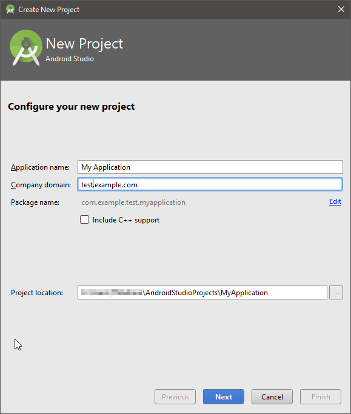
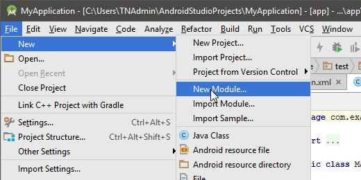
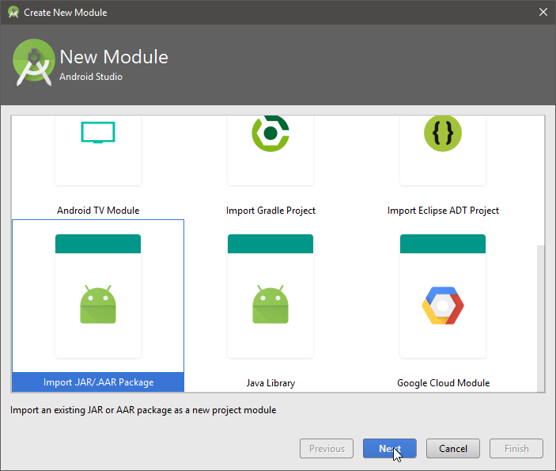
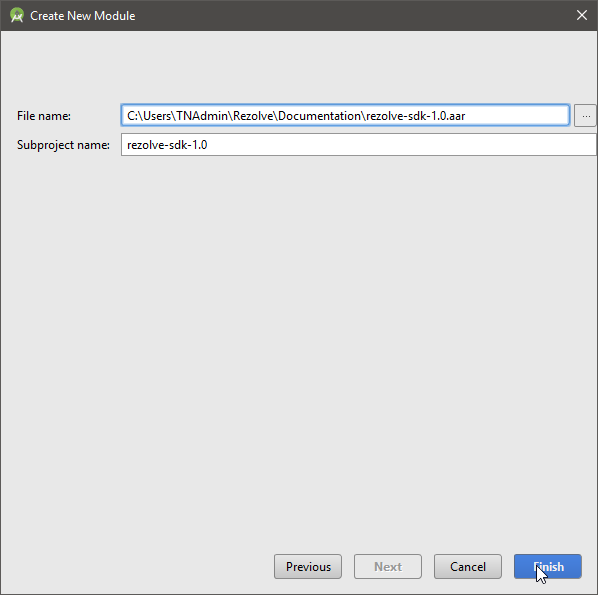
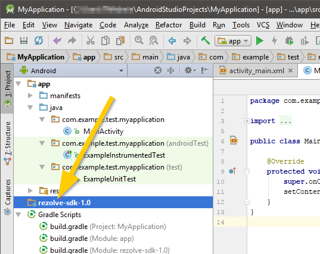

# Introduction

The **Rezolve SDK** is a software development kit that enables the app developer to integrate Rezolve's unique abilities within their app. 

## Capabilities

The Rezolve SDK is a full-featured application suite. Capabilities that can be integrated into your application include:

* Consumer account creation and Rezolve login
* Consumer profile and wallet management
* Consumer management of topup devices
* Scanning of Rezolve Encoded visual media
* Listening to Rezolve Encoded audio media
* Purchasing of scanned products
* Purchasing of topups
* Purchase history

## Intended audience

This document is intended for experienced IOS and Android developer. It is expected that you have built apps before, and know your way around an IDE.

## For more information

For more information on Rezolve, see http://rezolve.com.

# Getting Started

## Get an API key

Using the Rezolve API requires a contract. Please visit <a href="https://www.rezolve.com/#sectionForm">our contact form</a> and supply your info. We will respond ASAP, and provied an API key upon contract completion.

## Download the SDK

The Rezolve SDK for **IOS** can be downloaded here: <a href="#">TBD</a>

The Rezolve SDK for **Android** can be downloaded here: <a href="#">TBD</a>

## Set up the SDK - IOS

**XCode** is the target IDE for these instructions.

The IOS SDK is distributed as a .framework. This makes it easy to embed Rezolve capabilities in your app. The steps are as follows:

1. Open your existing project.<br/><br/>
2. Go to the app target’s General configuration page.<br/><br/>
3. Add the framework target to the Embedded Binaries section by clicking the Add icon, and picking the framework file you downloaded. Do not drag in the framework from Finder. <br/><br/><br/>
4. Select your framework from the list of binaries that can be embedded.

TODO: verify instructions with Marcos
TODO: do we need to import anythinng per file, or otherwise set up the framework in code to use it? Marcos

## Set up the SDK - Android

**Android Studio** is the target IDE for these instructions.

The Android SDK is distributed as an .aar library. This makes it easy to import Rezolve capabilities into your app. The steps are as follows:

1. For this demo, the project **test.example.com** has been created.<br/><br/><br/>
2. In your project, go to File > New Module... <br/><br/><br/>
3. ... and choose Import JAR/.AAR Package. Hit Next. <br/><br/><br/>
4. Select the SDK file you downloaded, and click Finish. File name may differ from what is shown in screenshot. <br/><br/><br/>
5. The SDK should import as a module. You are now ready to develop. <br/><br/><br/>

TODO: verify install instructions with Adam.
TODO: anything to import per file to use functions?

# App Flows

This section describes the intended usage of the SDK to build specific feature-related functionalities.

## Basic Usage

``` objective_c
import RezolveSDK

let API_KEY: String = "ABC123"           //substitute your api key here

let sdk: RezolveSDK = RezolveSDK(apiKey: API_KEY, env: .Development)

```

```java
import com.rezolve.sdk.RezolveSDK;
import com.rezolve.sdk.RezolveInterface;
import com.rezolve.sdk.RezolveSession;
import com.rezolve.sdk.core.callbacks.CheckoutCallback;
import com.rezolve.sdk.core.callbacks.FavouriteCallback;
import com.rezolve.sdk.core.callbacks.UserActivityCallback;
import com.rezolve.sdk.core.callbacks.WalletCallback;
import com.rezolve.sdk.core.interfaces.AddressbookInterface;
import com.rezolve.sdk.core.interfaces.ApiCheckInterface;
import com.rezolve.sdk.core.interfaces.FavouriteInterface;
import com.rezolve.sdk.core.interfaces.ProductInterface;
import com.rezolve.sdk.core.interfaces.WalletInterface;
import com.rezolve.sdk.core.utils.RequestType;
import com.rezolve.sdk.model.api.ApiStatus;
import com.rezolve.sdk.model.api.ApiVersions;
import com.rezolve.sdk.model.cart.Order;
import com.rezolve.sdk.model.useractivity.Transaction;
import com.rezolve.sdk.model.customer.Address;
import com.rezolve.sdk.model.customer.Favourite;
import com.rezolve.sdk.model.customer.PaymentCard;
import com.rezolve.sdk.model.foreign.SignUpRequest;
import com.rezolve.sdk.model.network.HttpResponse;
import com.rezolve.sdk.model.shop.Catalog;
import com.rezolve.sdk.model.shop.DisplayProduct;
import com.rezolve.sdk.model.shop.Merchant;
import com.rezolve.sdk.model.shop.Product;
import com.rezolve.sdk.model.shop.ProductBundle;

private final static String API_KEY = "ABC123";

RezolveSDK.getInstance(API_KEY,RezolveEnv.Development);

```

To get started, import the SDK into your file, and initialize it. When initializing the SDK in your page, you must specify your `API Key`, and the `server environment` you are targeting. 

Your `API Key` is supplied to you upon signup with Rezolve.

Your `server environment` is an enum with one of the following values: `Development`, `Sandbox`, or `Production`

TODO Marcos verify
TODO Adam verify


## Session Management, User Management

To get the SDK talking to backend services, you must establish a session. A session combines several  functions, and abstracts them from the developer:
* Verifies the validity of the mobile app, through the API key
* Creates the consumer account, if one doesn't exist
* Identifies the consumer and pairs them with a partner-supplied session token, and assigns them a Rezolve session token
* Verifies each request from the mobile app


``` objective_c
require 'kittn'

api = Kittn::APIClient.authorize!('meowmeowmeow')
```

```java
import kittn

api = kittn.authorize('meowmeowmeow')
```
For the purpose of the SDK, it is assumed the partner app is providing the authentication of users. Once the user is authenticated on the partner side, make a call to `createSession{}`. The first time `createSession{}` is called, it will create a Rezolve user account, and return an `entity_id` (Rezolve user id) and a `partner_id`. These values should be persisted locally for the life of the app, and if possible, stored server side on the partner server. 


To create a session, you must pass 

## Profile Management 

## Topup flow

## Scan to buy flow

## Checkout flow

# Modules

## Customer

### Register customer method

### Log in customer

### Log out customer

## Shop


# Errors

# Kitten API Examples

> To authorize, use this code:

``` objective_c
require 'kittn'

api = Kittn::APIClient.authorize!('meowmeowmeow')
```

```java
import kittn

api = kittn.authorize('meowmeowmeow')
```


> Make sure to replace `meowmeowmeow` with your API key.

Kittn uses API keys to allow access to the API. You can register a new Kittn API key at our [developer portal](http://example.com/developers).

Kittn expects for the API key to be included in all API requests to the server in a header that looks like the following:

`Authorization: meowmeowmeow`

<aside class="notice">
You must replace <code>meowmeowmeow</code> with your personal API key.
</aside>

# Kittens

## Get All Kittens

```ruby
require 'kittn'

api = Kittn::APIClient.authorize!('meowmeowmeow')
api.kittens.get
```

```python
import kittn

api = kittn.authorize('meowmeowmeow')
api.kittens.get()
```

```shell
curl "http://example.com/api/kittens"
  -H "Authorization: meowmeowmeow"
```

```javascript
const kittn = require('kittn');

let api = kittn.authorize('meowmeowmeow');
let kittens = api.kittens.get();
```

> The above command returns JSON structured like this:

```json
[
  {
    "id": 1,
    "name": "Fluffums",
    "breed": "calico",
    "fluffiness": 6,
    "cuteness": 7
  },
  {
    "id": 2,
    "name": "Max",
    "breed": "unknown",
    "fluffiness": 5,
    "cuteness": 10
  }
]
```

This endpoint retrieves all kittens.

### HTTP Request

`GET http://example.com/api/kittens`

### Query Parameters

Parameter | Default | Description
--------- | ------- | -----------
include_cats | false | If set to true, the result will also include cats.
available | true | If set to false, the result will include kittens that have already been adopted.

<aside class="success">
Remember — a happy kitten is an authenticated kitten!
</aside>

## Get a Specific Kitten

```ruby
require 'kittn'

api = Kittn::APIClient.authorize!('meowmeowmeow')
api.kittens.get(2)
```

```python
import kittn

api = kittn.authorize('meowmeowmeow')
api.kittens.get(2)
```

```shell
curl "http://example.com/api/kittens/2"
  -H "Authorization: meowmeowmeow"
```

```javascript
const kittn = require('kittn');

let api = kittn.authorize('meowmeowmeow');
let max = api.kittens.get(2);
```

> The above command returns JSON structured like this:

```json
{
  "id": 2,
  "name": "Max",
  "breed": "unknown",
  "fluffiness": 5,
  "cuteness": 10
}
```

This endpoint retrieves a specific kitten.

<aside class="warning">Inside HTML code blocks like this one, you can't use Markdown, so use <code>&lt;code&gt;</code> blocks to denote code.</aside>

### HTTP Request

`GET http://example.com/kittens/<ID>`

### URL Parameters

Parameter | Description
--------- | -----------
ID | The ID of the kitten to retrieve

