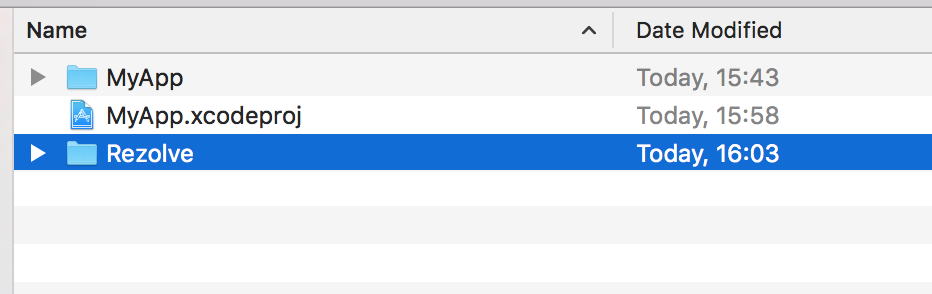
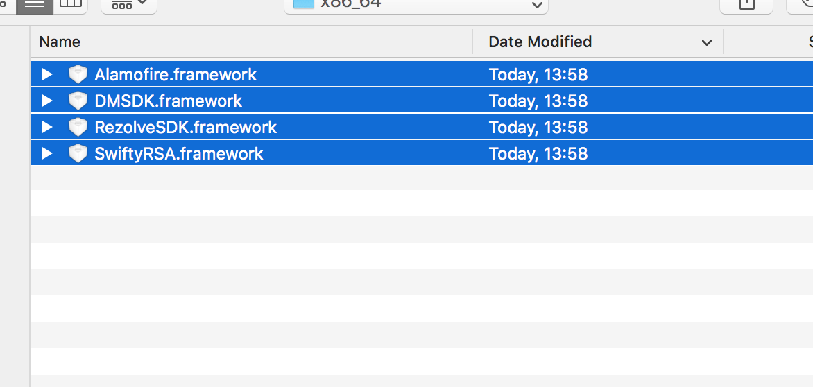
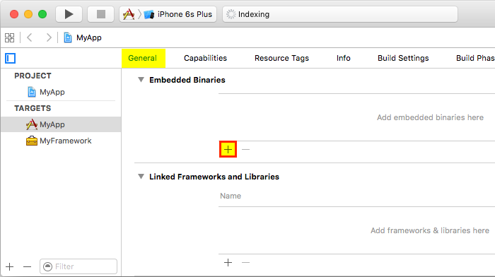
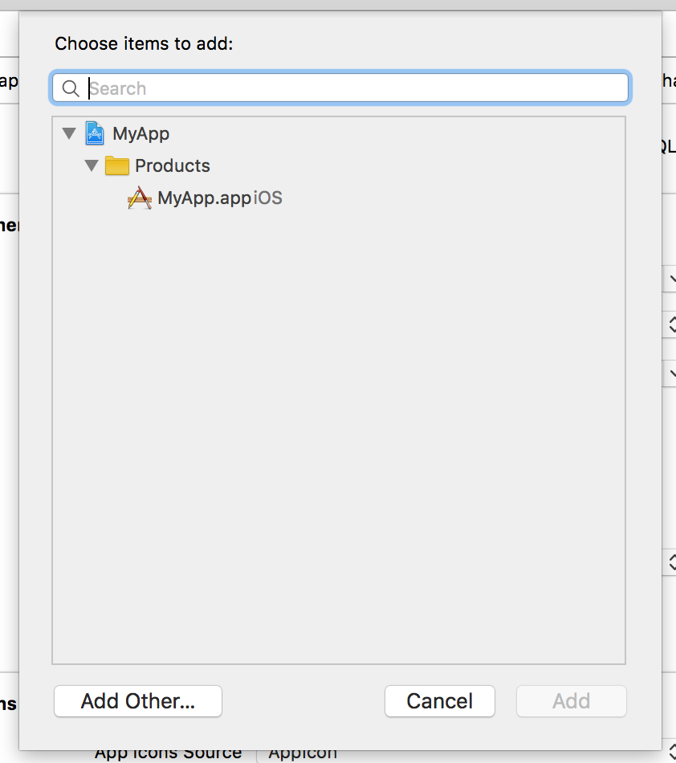
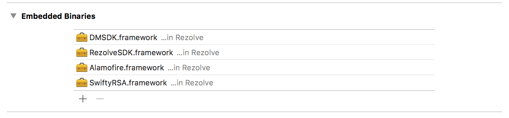
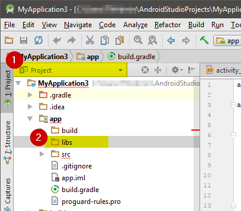
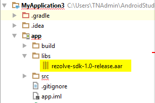
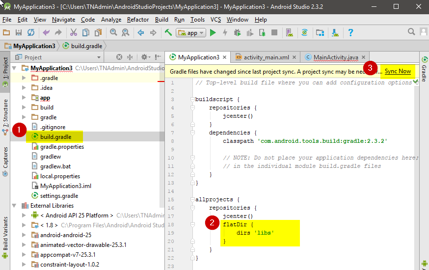
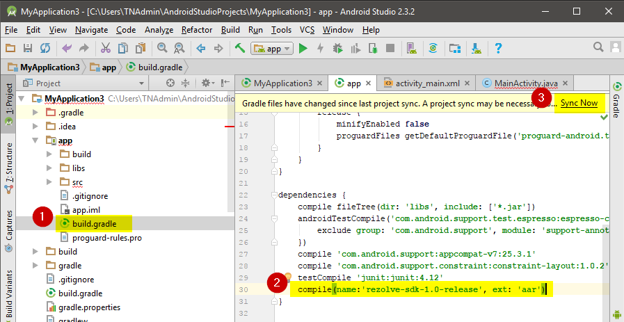

# Introduction

```html
Note:

Code samples for IOS and Android will appear in this column.

You can switch between IOS and Android by clicking the tabs above.
```

The **Rezolve Inside<sup>TM</sup> SDK** is a software development kit that enables mobile app developers to integrate Rezolve’s mobile commerce and engagement capabilities into their new or existing mobile apps.

To learn more about what the Rezolve Inside<sup>TM</sup> SDK can offer your app, <a href="images/RezolveOverview-Platform.pdf">click here for a platform overview PDF</a>.

## Demo App

A Rezolve demo app is available, and is a great way to experience Rezolve's offerings. A pdf of the screen flow is <a href="images/DemoAppFlowScreens.pdf">available here</a>.

If you would like access to the demo app, email Stephen Meli (stephen@rezolve.com) the following information:

1. Your full name
2. Your company
3. What country you are located in
4. Your contact phone number (and Skype ID if you have one)
5. Your phone OS (Android or IOS), OS version (if you know it), and phone model
6. The email address associated with your Android or IOS account (the one associated with the Play Store/App Store)
7. Your contact email, if it differs from your account email


## Capabilities

The Rezolve Inside<sup>TM</sup> SDK is a full-featured application suite. Capabilities that can be integrated into your application include:

* Enabling Shoppable Ads - <a href="images/RezolveOverview-ShoppableAds.pdf">Shoppable Ads PDF</a>
* Creating a browsable Mall - <a href="images/RezolveOverview-Mall.pdf">Mall PDF</a>
* Supporting Pre-pay account Top Up - <a href="images/RezolveOverview-TopUp.pdf">Top Up PDF</a>
* Consumer management of topup devices
* Scanning of Rezolve Encoded visual media
* Scanning of Rezolve Encoded audio media
* Consumer account creation, consumer profile, and purchase history
* Wallet management

The Rezolve Inside<sup>TM</sup> SDK and Platform feature a robust and state-of-the-art security model (see <a href="images/RezolveOverview-Security.pdf">see security overview PDF</a>).


## Intended audience

This document is intended for experienced IOS and Android developer. It is expected that you have built apps before, and know your way around an IDE.

## Term Definitions

|term|definition|
|---|---|
|Partner|The Partner is the owner of a mobile application and audience. It is the Partner who wishes to integrate the Rezolve Inside<sup>TM</sup> SDK capabilities with their app. |
|Developer|The Developer is the mobile app developer of the Partner.|
|Merchant|A merchant runs an ecommerce site that offers products for sale. Merchants also create Shoppable Ads and link them to products. A merchant may also offer device accounts that need Top Up. |
|Consumer|The end user of the Partner's mobile app. The customer who buys merchant products.|
|SDK|Refers to the Rezolve Inside<sup>TM</sup> SDK, unless otherwise specified.|


## For more information

For more information on Rezolve, see <a href="http://rezolve.com">http://rezolve.som</a>.


# Getting Started

## Supported OS Versions

|OS|Minimum Version|
|---|---|---|
|IOS|IOS 10 and up|
|Android|4.2.2 and up|


## Implement a Crash Reporting Sytem

To provide quality support, we require quality information. 

Rezolve advises using *<a href="https://fabric.io/kits/ios/crashlytics">Fabric Crashlytics</a>* to capture app problems on both IOS and Android.

We will not provide development support if you have not integrated Crashlytics or a similar tool.


## Download the Rezolve Inside<sup>TM</sup> SDK & Get an API Key

Latest release versions:
IOS: 1.6.5.0
Android: 1.7.5

To download the latest version, please <a href="license.html" target="_blank">go here to supply your contact info and agree to the SDK license</a>.

If this is your first time downloading the SDK, you will be provided with an API Key and the required environment information to begin development.


## Set up the SDK - IOS

The target IDE for IOS instructions is **XCode**. If you use a different IDE you may have to follow a different series of steps, please refer to your IDE documentation to understand how to incorporate third party SDKs into your IDE.

The IOS SDK is distributed as a framework. This makes it easy to embed Rezolve capabilities in your app. The steps are as follows:

1. Open your existing project root directory.<br/><br/>
2. Create a directory called Rezolve.<br/><br/><br/>
3. Copy all zip content to this new directory.<br/><br/><br/>
4. Next, go to the app target’s General configuration page. Add the framework target to the Embedded Binaries section by clicking the Add icon,<br/><br/><br/>
6. Click "Add Other", <br/><br/><br/>
7. ...and pick the framework file from the Rezolve directory you created in step 2. Do NOT drag in the framework from Finder.<br/><br/><br/>


## Set up the SDK - Android

The target IDE for Android instructions is **Android Studio**. If you use a different IDE you may have to follow a different series of steps, please refer to your IDE documentation to understand how to incorporate third party SDKs into your IDE.

The Android SDK is distributed as an .aar library. This makes it easy to import Rezolve capabilities into your app. The steps are as follows:

<ol>
<li> In your project, change to the Project view, and add the .aar file you downloaded to the /libs folder. If prompted by Android Studio to select the file association, pick “Archive”. <br/><br/><br/><br/></li></ol>

```java
flatDir {
    dirs 'libs'
}
```

<ol start="2"><li>In the project-level gradle file, specify the libs dir as "flatDir". <br/><br/><br/></li></ol>

```java
compile(name:'rezolve-sdk-1.0-release', ext: 'aar')
```

<ol start="3"><li>Lastly, in the application-level gradle file, add the Rezolve Inside<sup>TM</sup> SDK as a dependency (change filename/version as needed to match your download). If necessary, re-sync the project.<br/><br/><br/></li><li>The SDK is ready to use.</li></ol>


