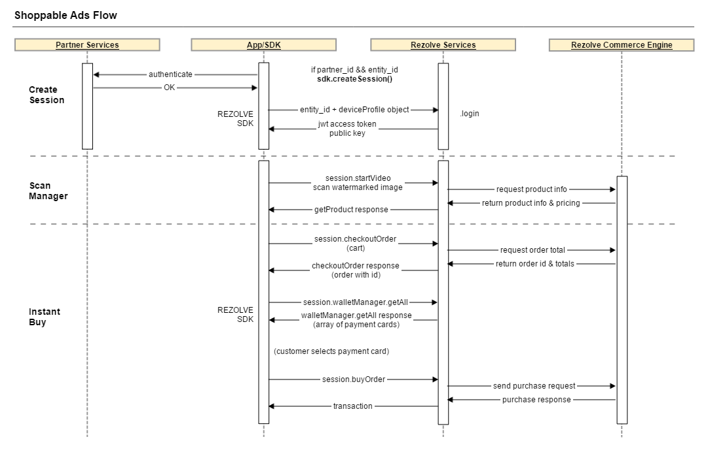

# Introduction

The **Rezolve Inside<sup>TM</sup> SDK** is a software development kit that enables mobile app developers to integrate Rezolve’s mobile commerce and engagement capabilities into their new or existing mobile apps.
## Capabilities

```html
Note:

Code samples for IOS and Android will appear in this column.

You can switch between IOS and Android by clicking the tabs above.
```

The Rezolve Inside<sup>TM</sup> SDK is a full-featured application suite. Capabilities that can be integrated into your application include:

* Enabling Shoppable Ads - <a href="images/RezolveOverview-ShoppableAds.pdf">see Shoppable Ads PDF</a>
* Creating a browsable Mall - <a href="images/RezolveOverview-Mall.pdf">see Mall PDF</a>
* Supporting Pre-pay account Top Up - <a href="images/RezolveOverview-TopUp.pdf">see Top Up PDF</a>
* Consumer account creation and Rezolve login
* Consumer profile and wallet management
* Consumer management of topup devices
* Scanning of Rezolve Encoded visual media
* Listening to Rezolve Encoded audio media
* Purchase history

## Intended audience

This document is intended for experienced IOS and Android developer. It is expected that you have built apps before, and know your way around an IDE.

## Term Definitions

|term|definition|
|---|---|
|Partner|The Partner is the owner of a mobile application and audience. It is the Partner who wishes to integrate the Rezolve Inside<sup>TM</sup> SDK cababilities with their app. |
|Developer|The Developer is the mobile app developer of the Partner.|
|Merchant|A merchant runs an ecommerce site that offers products for sale. Merchants also create Shoppable Ads and link them to products. A merchant may also offer device accounts that need Top Up. |
|Consumer|The end user of the Partner's mobile app. The customer who buys merchant products.|
|SDK|Refers to the Rezolve Inside<sup>TM</sup> SDK, unless otherwise specified.|


## For more information

For more information on Rezolve, see http://rezolve.com.


# Getting Started

## Get an API key

You will need an API key to use the Rezolve Inside<sup>TM</sup> SDK.  Please visit <a href="https://www.rezolve.com/#sectionForm">the contact page</a> and request an API key. We’ll establish some basic information to form a contract of use, and send for your approval. Upon signature, we will provide an API key for you to use.

## Download the SDK

The Rezolve Inside<sup>TM</sup> SDK for **IOS** can be downloaded here: <a href="#">TBD</a>

The Rezolve Inside<sup>TM</sup> SDK for **Android** can be downloaded here: <a href="#">TBD</a>

## Set up the SDK - IOS

The target IDE for IOS instructions is **XCode**. If you use a different IDE you may have to follow a different series of steps, please refer to your IDE documentation to understand how to incorporate third party SDKs into your IDE.

The IOS SDK is distributed as a .framework. This makes it easy to embed Rezolve capabilities in your app. The steps are as follows:

1. Open your existing project.<br/><br/>
2. Go to the app target’s General configuration page.<br/><br/>
3. Add the framework target to the Embedded Binaries section by clicking the Add icon, and picking the framework file you downloaded. Do not drag in the framework from Finder. <br/><br/><br/>
4. Select the Rezolve framework from the list of binaries that can be embedded.


## Set up the SDK - Android

The target IDE for Android instructions is **Android Studio**. If you use a different IDE you may have to follow a different series of steps, please refer to your IDE documentation to understand how to incorporate third party SDKs into your IDE.

The Android SDK is distributed as an .aar library. This makes it easy to import Rezolve capabilities into your app. The steps are as follows:

<ol>
<li> In your project, change to the Project view, and add the .aar file you downloaded to the /libs folder. If prompted by Android Studio to select the file association, pick “Archive”. If necessary, re-sync the project.<br/><br/><br/><br/></li>

```java
flatDir {
    dirs 'libs'
}
```

<li>In the project-level gradle file, specify the libs dir as "flatDir". <br/><br/><br/></li>

```java
compile(name:'rezolve-sdk-1.0-release', ext: 'aar')
```

<li> Lastly, in the application-level gradle file, add the Rezolve Inside<sup>TM</sup> SDK as a dependency, and resync if necessary.  Note: change filename/version as needed to match your download. <br/><br/><br/></li>

</ol>

# SDK Feature Use

This section describes the intended usage of the SDK to build specific feature-related functionalities.

## Basic Usage

``` objective_c
import RezolveSDK

...

let API_KEY: String = "ABC123"           //substitute your api key here
let sdk: RezolveSDK = RezolveSDK(apiKey: API_KEY, env: .Development)

// possible values for env: enum are .Development , .Sandbox, and .Production
```
```java
// Import the following classes:
import com.rezolve.sdk.RezolveInterface;
import com.rezolve.sdk.RezolveSDK;
import com.rezolve.sdk.RezolveSession;
import com.rezolve.sdk.model.customer.DeviceProfile;
import com.rezolve.sdk.model.foreign.SignUpRequest;

// To handle server responses you will need to import interfaces or
// abstract classes from the following packages:
import com.rezolve.sdk.core.callbacks.*;
import com.rezolve.sdk.core.interfaces.*;


// Rezolve SDK operates on models from com.rezolve.sdk.model subpackages. 
// For example to handle a response from getMerchants query you will need a Merchant model:
import com.rezolve.sdk.model.shop.Merchant;

// initialize SDK
// possible values for RezolveSDK.Env enum are .DEVELOPMENT , .SANDBOX, and .PRODUCTION
private static final String API_KEY = "1234567890";
RezolveSDK sdk = RezolveSDK.getInstance(API_KEY, RezolveSDK.Env.DEVELOPMENT);

```

To get started, import the SDK into your file.

The SDK must be initialized before use. When initializing the SDK, you must specify your `API Key`, and the `server environment` you are targeting.

Your `API Key` is supplied to you when you set up a developer account with Rezolve.

Your `server environment` is an enum. See values, right.


##  User Management, Session Management

For the purpose of the SDK, it is assumed the partner has an existing community of consumers, and has a method of authenticating them in the partner app. It is further assumed the partner wishes to introduce their consumes to Rezolve capabilities. Each partner consumer that wishes to utilize Rezolve services will need a Rezolve account.

This section will describe how to:

1. Register a Rezolve user via the SDK
2. Create a Session for that user
3. When the user is done, log them out

<br/>[ <a href="images/loginsequencediagram.png">View full size</a> ]

### Register User

```objective_c
let request: AuthenticationRequest = authenticationRequest()
// TODO populate authenticationRequest object

let sdk: RezolveSDK = RezolveSDK(apiKey: API_KEY, env: .Development)

sdk.registerUser(authenticationRequest: request) {  (entityId, partnerId) in 
	// persist the entity_id and partner_id values here
}
```
```java
DeviceProfile deviceProfile = new DeviceProfile(deviceId, deviceManufacturer, locale);
SignUpRequest signUpRequest = new SignUpRequest.Builder()
    .email("john.doe@domain.com")
    .firstName("John")
    .lastName("Doe")
    .name("JDoe")
    .device(deviceProfile)
    .build();

RezolveSDK.getInstance(API_KEY, RezolveSDK.Env.PRODUCTION).registerUser(signUpRequest, 
new RezolveInterface() {
    @Override
    public void onInitializationSuccess(RezolveSession rezolveSession, String partnerId, 
    String entityId) {
    	// persist the entity_id and partner_id values here
        ...

        // set session for convenience
        mySession = rezolveSession;
    }

    @Override
    public void onInitializationFailure() {
    	// handle failure here
    }
});

```

To register a user, you will need to call the sdk `registerUser` method, passing in an `SignUpRequest object`. The SignUpRequest object is defined as shown to the right. It is composed of a deviceProfile object, and four user data fields. All fields are strings.

The `registerUser` method is used as shown to the right. Upon successful registration, the response will contain a `partner_id` and an `entity_id`. **Persist both these values for the life of the app.**

<aside class="notice">
You will know if you need to call `registerUser` instead of `createSession` if either `partner_id` or `entity_id` are null or blank.
</aside>

<aside class="warning">
It is recommended that <code>entity_id</code> and <code>partner_id</code> be persisted to the partner server. If these values are stored server side, a consumer who uninstalls the app and reinstalls will be able to retain their history and settings. Without this info, their account cannot be reassociated after install.
</aside>


### Create Session

``` objective_c
let request: AuthenticationRequest = authenticationRequest()
// TODO populate authenticationRequest object

let sdk: RezolveSDK = RezolveSDK(apiKey: API_KEY, env: .Development)

sdk.createSession(authenticationRequest: request) { (session: RezolveSession) in
	// use created session to access managers
    // example: session.CustomerProfileService.get
}
```
```java
RezolveSDK.getInstance(API_KEY, RezolveSDK.Env.PRODUCTION).createSession(entityId, 
partnerId, deviceProfile, new RezolveInterface() {
    @Override
    public void onInitializationSuccess(RezolveSession rezolveSession, String s, 
    String s1) {
        mySession = rezolveSession;
        // use created session to access managers
    }

    @Override
    public void onInitializationFailure() {
        // handle failed initialization
    }
});


// Note: You don't need to create a new session if user navigatess to another activity. 
// After the session is created, you can access it by calling:

RezolveSession rezolveSession = RezolveSDK.getInstance(API_KEY, RezolveSDK.Env.PRODUCTION)
.getRezolveSession();


```
To log in and interact with Rezolve services, you must establish a session. A session combines several functions, and abstracts them from the developer:

* Verifies the validity of the mobile app, through the API key
* Identifies the consumer and pairs them with a session token
* Verifies each request from the mobile app by passing API Key and session token
* establishes a public key for the session, for encrypting transmitted credit card info

Once the user is authenticated on the partner side, make a call to `createSession{}`, passing in the `entity_id` and a `deviceProfile` object. The server will respond with a session authentication token, and a session public key; the SDK takes care of managing these for the session. The auth token is used to authenticate each request from the client, while the public key is used for encrypting the transmission of payment card information for this session.

When the session is established, you can begin to access services, for example:
`session.CustomerProfileService.get`


### Logout Session

``` objective_c
// When session ends you should inform the sdk by calling
session.authenticationService.logout();

```
```java
// When session ends you should inform the sdk by calling
rezolveSession.getAuthenticationManager().logout(entityId);
```
When a seession is over, you should notify the SDK by passing the `entity_id` to the logout method.

## Consumer Profile Management

Once logged in, you have access to the consumer's records. These include:
* Consumer Profile - Via the `ConsumerProfileService`. Name, email, and device profile (phone info) for the consumer
* Address Book - Via the `AddressbookService`. A collection of postal addresses, to be used for ship-to and bill-to purposes.
* Favorites - Via the `FavouriteService`. A collection of devices that can be topped up.  A favorite can represent a mobile phone, a tollway transponder, or other device/account.
* Wallet - Via the `WalletService`. Wallet lets you store credit card info securely, and lets the consumer maintain the list of cards. There can be multiple cards.

There are no specific flows to consider when managing the customer profile and assicated records.

AddressbookService, FavouriteService, and WalletService support the following CRUD operations: `create`, `update`, `delete`, `getAll`, `get`.

ProfileService supports only `update` and `get`.

#### Android-specific instructions on Managers

``` objective_c
 
```
```java
public class MyActivity extends AppCompatActivity implements WalletInterface {

	...

	@Override
	protected void onCreate(Bundle savedInstanceState) {
		RezolveSDK.getInstance(API_KEY, RezolveSDK.Env.PRODUCTION).getRezolveSession()
        .getWalletManager().getAll(this);
	}

	@Override
	public void onWalletGetAllSuccess(List<PaymentCard> list) {  
		// handle getAll response here
		for(PaymentCard paymentCard : list) {
    			String cardId = paymentCard.getId();
			String expiresOn = paymentCard.getExpiresOn();
		}
	}

	@Override
	public void onWalletGetSuccess(PaymentCard paymentCard) {  
	}

	@Override
	public void onWalletUpdateSuccess(PaymentCard paymentCard) { 
	}

	@Override
	public void onWalletCreateSuccess(PaymentCard paymentCard) {
	}

	@Override
	public void onWalletDeleteSuccess(HttpResponse httpResponse) {
	}

	@Override
	public void onFailure(HttpResponse httpResponse) { 
	}
}


// Alternately, if you only intend to use one of the methods provided by the 
// manager, you can handle the response in a WalletCallback:
rezolveSession.getWalletManager().getAll(new WalletCallback() {
    @Override
    public void onWalletGetAllSuccess(List<PaymentCard> list) {
        // handle getAll response here
    }
});

```

To use a method from a manager you need to pass a corresponding interface. For example, if you want to use `WalletManager` methods your current activity should implement `WalletInterface`:

## Shoppable Ads flow

<br/>[ <a href="images/ShoppableAddsFlow.png">View full size</a> ]

The premise of Shoppable Ads is to capture an image scan (usually of an advertisement) using the Scan Manager, resolve it into a product URL, fetch the product info, and enable purchase via saved account information.

#### 1. Capture image and get product URL

``` objective_c
 
```
```java
 
```
First, enable the scan screen using `session.startVideo()`, and capture a watermarked image. The Digimarc SDK will extract an ad id from the image. Use the scanManager to fetch the product URL associated with the id from the Digimarc server. This url will point to a getProduct API endpoint.

#### 2. Fetch product info

``` objective_c
 
```
```java
rezolveSession.getProductManager().getProduct(merchant, catalog, productId, new ProductCallback() {
    @Override
    public void onGetProductSuccess(Product product) {
        String title = product.getTitle();
        // handle result
    }
});

```

Use the SDK `getProduct` call to retrieve product information. The `partner_id`, `merchant_id`, `catalog_id` and `product_id` will be in the URL received from Digimarc; the body of the request can be empty.  The response will include the title, price, description, variant choices, and images for the product.

#### 3. Create an order and get an order total

``` objective_c
 
```
```java
HashMap<String, String> options = new HashMap<>();
options.put("color", "red");

CheckoutProduct checkoutProduct = new CheckoutProduct();
checkoutProduct.setId(product.getId());
checkoutProduct.setPrice(product.getPrice());
checkoutProduct.setTitle(product.getTitle());
checkoutProduct.setQty(5);
checkoutProduct.setOptions(options);

HashMap<String, String> deliverySettings = new HashMap<>();
deliverySettings.put("delivery_address_id", "123123");

HashMap<String, String> loyaltySettings = new HashMap<>();
loyaltySettings.put("loyalty_id", "123123");

HashMap<String, Double> geoLoc = new HashMap<>();
geoLoc.put("lat", 12.3123);
geoLoc.put("long", 31.1323);

List<CheckoutProduct> items = new ArrayList<>();
items.add(checkoutProduct);

Cart cart = new Cart.Builder()
        .merchantId(product.getMerchantId())
        .type("scan")
        .deliverySettings(deliverySettings)
        .loyaltySettings(loyaltySettings)
        .geoLoc(geoLoc)
        .items(items)
        .build();

rezolveSession.getCheckoutManager().checkoutOrder(cart, new CheckoutCallback() {
    @Override
    public void onCheckoutOrderSuccess(Order order) {
        String orderId = order.getOrderId();
        //handle result
    }
});
```

Once you have product information, call the SDK `checkoutOrder` method. Pass in the merchant, type, delivery address id, loyalty info (if any), geolocation if available, and finally the information on the desired product, including variant choices.  The response will include an order id, final total price, and a price breakdown (composed of base price, variant price premium if any, shipping, and tax). 

#### 4. Show payment card choices

``` objective_c
 
```
```java
rezolveSession.getWalletManager().getAll(new WalletCallback() {
    @Override
    public void onWalletGetAllSuccess(List<PaymentCard> list) {
        // handle getAll response here
    }
});
```

If the consumer agrees with the price and wishes to complete the order, use `walletService.getAll` to list the available card choices. The consumer will choose a payment card.

At this point, we recommend using a "slide to buy" button to confirm purchase intent, while preserving the maximum ease of use.

#### 5. Submit payment for order

``` objective_c
 
```
```java

```

When the user confirms intent, pass the card choice and the entered CVV value to the `buyOrder` method. The response will contain either an order confirmation with receipt info, or if rejected, an error with the reason for the order rejection.

## Top Up flow

<br/>[ <a href="images/Topup%20Flow.png">View full size</a> ]

#### 1. Add the top up target as a Favorite
``` objective_c
 
```
```java
Favourite favourite = new Favourite(id, value, type, provider);

rezolveSession.getFavouriteManager().create(favourite, new FavouriteCallback() {
    @Override
    public void onFavouriteCreateSuccess(Favourite favourites) {
    }
});

```
The top up flow gives the mobile consumer the ability to add money to a remote account that is linked with a specific device, such as a mobile phone or tollway transponder. The consumer must have first added the topup device (called a Favorite) to their account, using the `FavouriteService.create` method.

#### 2. List available favorites
``` objective_c

```
```java
rezolveSession.getFavouriteManager().getAll(new FavouriteCallback() {
    @Override
    public void onFavouriteGetAllSuccess(List<Favourite> favourites) {
        for(Favourite favourite : favourites) {
            String favouriteId = favourite.getId();
            // handle response
        }
    }
});
```
Once there is one or more favorites, use the `FavouriteService.getAll` method to list them. The customer will choose a favorite.

#### 3. Get a list of topup amounts using getProducts
``` objective_c

```
```java
rezolveSession.getProductManager().getProducts(merchant, catalog, count, 
pageIndex, sortBy, sortDirection, new ProductCallback() {
    @Override
    public void onGetProductsSuccess(PageResult<DisplayProduct> pageResult) {
        int count = pageResult.getCount();
        int total = pageResult.getTotal();
        Link[] links = pageResult.getLinks();
        List<DisplayProduct> displayProducts = pageResult.getEmbedded();
        for(DisplayProduct displayProduct : displayProducts) {
            String title = displayProduct.getTitle();
            // fetch other params as needed
        }
    }
});

```
The customer next wants to see a list of possible top up amounts. Each top up amount is stored as a separate product with its own SKU, and these products are grouped into a catalog. To list the top up amounts, we use the `getProducts` method, passing in a fixed category id. 

Display the list of top up choices. You can display each "product" as a currency amount, or utilize the "description" field of the product to give more information about the topup. It depends on your application. The consumer will choose a top up amount.

#### 4. Get an order total
``` objective_c

```
```java

```
When you have the product choice, call the SDK `checkoutOrder` method. Pass in the merchant, type, delivery address id, loyalty info (if any), geolocation if available, and finally the information on the chosen product.  The response will include an order id, final total price, and a price breakdown (composed of base price, shipping, and tax).

#### 5. Show payment card choices
``` objective_c

```
```java
rezolveSession.getWalletManager().getAll(new WalletCallback() {
    @Override
    public void onWalletGetAllSuccess(List<PaymentCard> list) {
        // handle getAll response here
    }
});
```
If the consumer agrees with the price and wishes to complete the order, use `walletService.getAll` to list the available card choices. The consumer will choose a payment card.

At this point, we recommend using a "slide to buy" button to confirm purchase intent, while preserving the maximum ease of use.

#### 6. Submit payment for order
``` objective_c

```
```java

```
When the user confirms intent, pass the card choice and the entered CVV value to the `buyOrder` method. The response will contain either an order confirmation with receipt info, or if rejected, an error with the reason for the order rejection.


# Error Handling

```json
{
  "errors":[
    {
      "type":"<error_type>",
      "code":"<error_code>",
      "message":"<error_message>"
    }
  ]
}
```
All SDK methods use a uniform error format, as shown at the right. Possible values are:

|Type|Error Code|Message|
|---|---|---|
|Authentication|1|Access is denied.|
|Registration|2|Registration failed.|
|Not Found|4|Requested resource not found|
|Bad Request|5|Incorrect or malformed parameters|


